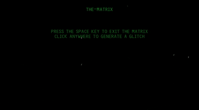

# 12. The Matrix 👾
## Enter into the matrix

The idea of this tutorial is to recreate the iconic "digital rain" visual effect from The Matrix franchise. This processing sketch renders vertical streams of green characters falling down a grid overlaying a dark background. Beyond a static video loop, this script functions as an interactive, real-time animation. It implements a custom "glitch" engine that randomly mutates the character set mid-stream, dynamic trail fading to simulate neon persistence, and user interactivity via mouse clicks and keyboard commands to control the simulation state.

Check the [Blog Post]()  that this repo is connected to.

---

### Find me on social media

[
](http://facebook.asankasovis.com)          
            